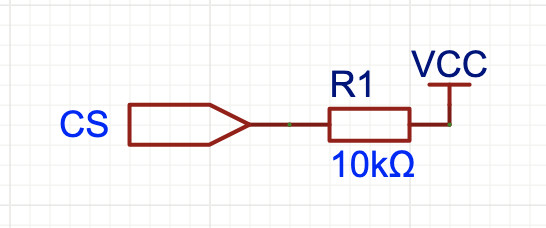
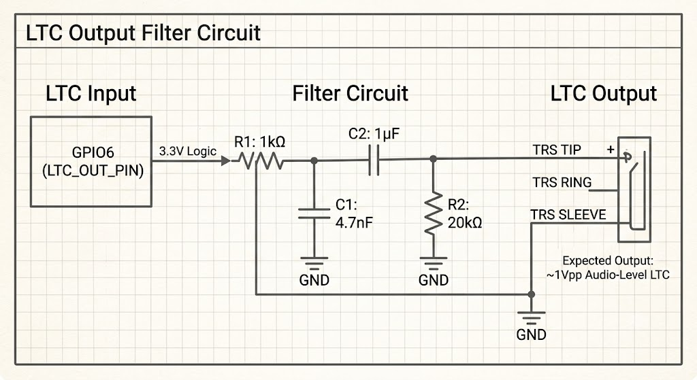
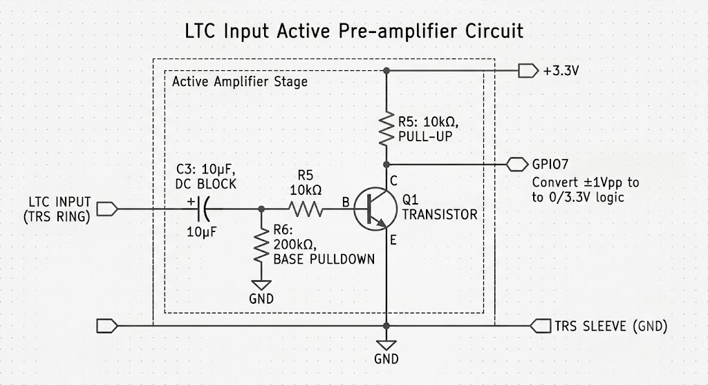

# [VID-PRO](https://www.vid-pro.de) TC-WL

Reads Panasonic GH5 timecode from HDMI via TC358743 and regenerates it as SMPTE-12M LTC audio. Three PlatformIO environments: **TC-WL-HDMI** (Waveshare ESP32-P4-WIFI6, HDMI receiver, BLE server), **TC-WL-LTC** (Seeed Studio XIAO ESP32-C3, dual-role: BLE server with LTC input or BLE client with LTC output), and **TC-WL-CLAP** (ESP32-C3, BLE client, LED matrix + OLED). TC-WL-HDMI has no LED matrix — it uses a different GPIO layout from the LTC/CLAP boards.

---

## Features

| Category | Details |
|----------|---------|
| **HDMI timecode capture** | Decodes GH5 timecode from HDMI Vendor-Specific InfoFrame via TC358743 I2C — no video decoding needed |
| **LTC generation** | Standalone SMPTE-12M biphase-mark encoder, esp_timer-driven, independent of I2C polling |
| **Frame rates** | Auto-detected from HDMI (24/25/30/50/60 fps) or manual via web UI |
| **RTC fallback** | HDMI uses ESP32-P4 internal RTC (synced by HDMI timecode); LTC/CLAP use optional external DS3231 — both with frame interpolation |
| **LED matrix (CLAP)** | 8 daisy-chained MAX7219 8×8 modules (64×8 px), software SPI; runtime toggle in web UI; not available on HDMI or LTC (GPIO conflict with buttons) |
| **OLED display (optional)** | 128×64 SSD1306 on shared I2C bus: device name, battery gauge + runtime, big timecode, 5 bottom boxes (MASTER/SLAVE, lock state, A/M, fps, LTC mode) — controlled via 4 physical buttons on HDMI/LTC; CLAP main screen only (no buttons) |
| **Web UI** | Fullscreen dark-teal SPA: timecode display, Auto/fixed FPS config, jam sync, brightness slider, matrix on/off, WiFi config |
| **WiFi** | AP on boot; auto-STA connect to saved network; AP re-enables on disconnect |
| **Reverse-engineer mode** | Dumps InfoFrame packets over serial to find GH5's exact timecode byte layout |
| **BLE wireless sync** | HDMI advertises timecode via BLE notify; LTC/CLAP scan by service UUID, subscribe to notifications, run local LTC + display |
| **BLE config** | Android app sends config commands (FPS, brightness, jam, mode, name, restart) over BLE config characteristic `9a6f0004` — no WiFi needed |

---

## Hardware

### Bill of Materials

#### TC-WL-HDMI (Waveshare ESP32-P4-WIFI6)
| Component | Notes | Buy |
|-----------|-------|-----|
| **Waveshare ESP32-P4-WIFI6** | ESP32-P4 + ESP32-C6 companion for WiFi/BLE | [waveshare.com](https://www.waveshare.com) |
| **TC358743 HDMI→CSI-2** | e.g. Geekworm C790 — I2C + CSI-2 | widely available |
| **22-pin to 15-pin CSI ribbon cable** | Connects TC358743 to ESP32-P4-WIFI6 CSI connector | search "22-pin to 15-pin CSI cable" |
| **128×64 OLED SSD1306 (optional)** | I2C, shares bus with TC358743 | any electronics supplier |
| **3.5mm TRS jack** | LTC audio output | any electronics supplier |
| **R1: 1kΩ, C1: 4.7nF, C2: 1µF** | LTC low-pass + DC block | — |
| **R3, R4: 10kΩ** | LTC level pad | — |
#### TC-WL-LTC (Seeed Studio XIAO ESP32-C3)

| Component | Notes |
|-----------|-------|
| **Seeed Studio XIAO ESP32-C3** | 400 MHz RISC-V, USB-C |
| **MAX7219 8×8 LED matrix** | 8 daisy-chained modules (64×8 px) |
| **DS3231 RTC (optional)** | I2C |
| **128×64 OLED SSD1306 (optional)** | I2C |
| **3.5mm TRS jack** | LTC audio in/output |
| **Passives** | Same RC filter as HDMI board |

### Pinout

| Function | TC-WL-HDMI (ESP32-P4) | TC-WL-LTC (ESP32-C3) | TC-WL-CLAP (ESP32-C3) |
|----------|----------------------|----------------------|----------------------|
| **I2C SDA** | GPIO 7 | GPIO 4 | GPIO 4 |
| **I2C SCL** | GPIO 8 | GPIO 5 | GPIO 5 |
| **I2C devices** | TC358743 `0x0F`, OLED `0x3C` | OLED `0x3C`, DS3231 `0x68` | OLED `0x3C` |
| **MAX7219 DIN** | — | — | GPIO 2 |
| **MAX7219 CS** | — | — | GPIO 3 |
| **MAX7219 CLK** | — | — | GPIO 10 |
| **LTC output** | GPIO 6 | GPIO 6 | GPIO 6 |
| **LTC input (master)** | — | GPIO 7 | — |
| **Battery ADC (LiPo)** | GPIO 20 (ADC1_CH4)² | GPIO 0 (A0) | GPIO 0 (A0) |
| **Button UP** | GPIO 27 | GPIO 8 | — |
| **Button DOWN** | GPIO 32 | GPIO 9 | — |
| **Button OK** | GPIO 33 | GPIO 2 | — |
| **Button CANCEL** | GPIO 46 | GPIO 3 | — |
| **TC358743 reset** | GPIO 4 (CSI CE pin) | — | — |
| **CSI connector** | 22-pin to TC358743 | — | — |

> ² Also available: GPIO 21 (ADC1_CH5, pin 11), GPIO 22 (ADC1_CH6, pin 7), GPIO 23 (ADC1_CH7, pin 8). All on 40-pin header, no conflicts with I2C/buttons/LTC/reset/CSI.

---

## Software

### Environments

| Env | Board | Role | BLE | Platform |
|-----|-------|------|-----|----------|
| `TC-WL-LTC` | Seeed Studio XIAO ESP32-C3 | Dual-role: master (BLE server + LTC input) or slave (BLE client + LTC output), OLED + RTC, physical buttons, OLED menu; MAX7219 matrix not supported (GPIO conflict with buttons) | ✓ (native C3) | `pioarduino/platform-espressif32`† |
| `TC-WL-CLAP` | ESP32-C3 Super Mini | BLE client, LED matrix + OLED, no physical buttons | ✓ (native C3) | `pioarduino/platform-espressif32`† |
| `TC-WL-HDMI` | ESP32-P4-WIFI6 | HDMI receiver, BLE server (multi-connection), physical buttons + OLED menu | via C6 coprocessor‡ (ESP-Hosted SDIO) | `pioarduino/platform-espressif32`† |

† Pinned to GitHub: `https://github.com/pioarduino/platform-espressif32.git` (needed for ESP32-P4 `esp_timer` API compatibility; also used by LTC/CLAP for consistency)
‡ ESP32-P4 has no native BLE controller. The Waveshare board's ESP32-C6 companion provides WiFi/BLE over SDIO via ESP-Hosted firmware (pre-flashed). On cold power-on the C6 may take 8-12s to boot; the P4 prints a countdown, then calls `BLEDevice::init()` which blocks on ESP-Hosted SDIO enumeration until the C6 responds. All BLE code uses preprocessor guards (`SOC_BLE_SUPPORTED \|\| CONFIG_ESP_HOSTED_ENABLE_BT_NIMBLE`) to compile correctly on P4.

> **⚠️ NimBLE `reset()` bug**: The Arduino BLE library's NimBLE `reset()` omitted `m_advParams.channel_map` (defaulted to 0 = no advertising channels). This caused the C6 to never transmit ADV_IND frames — the device was connectable via direct CONNECT_IND (LTC worked) but invisible to BLE scanners. Fixed by patching the installed library at `BLEAdvertising.cpp:1459` to set `channel_map = 0x07`. A second fix restarts advertising after each connection so the Android app can discover the HDMI even while the LTC is connected.

### Building

```bash
# LTC (ESP32-C3, full I/O)
pio run -e TC-WL-LTC -t upload

# CLAP (ESP32-C3, LED matrix only)
pio run -e TC-WL-CLAP -t upload

# HDMI (ESP32-P4-WIFI6)
pio run -e TC-WL-HDMI -t upload
```

Monitor:
```bash
pio device monitor -b 115200
```

### Project Layout

```
platformio.ini
src/config.h                   pin assignments, feature toggles, battery runtime default (common base)
src/config_tcwl_ltc.h             -include for TC-WL-LTC env
src/config_tcwl_clap.h            -include for TC-WL-CLAP env
src/config_tcwl_hdmi.h            -include for TC-WL-HDMI env
src/main.cpp                   compile-time dispatch: TC-WL-HDMI/LTC/CLAP paths
src/webui/                     WiFi AP/STA, HTTP server, NVS, embedded JS/CSS/HTML
src/hdmi/                      TC358743 I2C driver + register map + GH5 timecode decoder
src/ltc/                       esp_timer-based SMPTE-12M LTC generator
src/matrix/                    MAX7219 64×8 framebuffer driver (CLAP only)
src/oled/                      optional SSD1306 via U8g2
src/rtc/                       DS3231 (external) or InternalRtc (ESP32-P4 POSIX time) RTC driver
src/timecode/                  BLE HDMI (advertise/notify) & LTC (scan/select/connect/subscribe)
3DPrints/                     STL/3MF enclosures for TC-WL-HDMI (ESP32-P4) and TC-WL-CLAP (ESP32-C3 + LED matrix)
```

---

## WiFi

| Scenario | Behavior |
|----------|----------|
| No WiFi configured | Opens AP with default SSID (HDMI: `TC-WL-HDMI-XXXX`, LTC: `TC-WL-LTC-XXXX`, CLAP: `TC-WL-CLAP-XXXX`), open network, `192.168.4.1` |
| Saved credentials exist | Connects as STA on boot; AP auto-disables on connect |
| STA disconnected >5 s | AP re-enabled for reconfiguration |

---

## Web Interface

Open `http://192.168.4.1` (AP mode) or the ESP's STA IP. The header displays a centered **VID-PRO** link (https://www.vid-pro.de).

| Feature | Description |
|---------|-------------|
| **Timecode display** | Fullscreen `dd:hh:mm:ss:ff` with color-coded status dot (green=HDMI, orange=RTC, gray=free) |
| **FPS config** | Auto (re-detect from HDMI) or fixed 24/25/30/50/60, drop-frame toggle, saved to NVS |
| **Jam sync** | Set timecode manually (dd:hh:mm:ss:ff) |
| **Brightness (LTC/CLAP)** | Slider for MAX7219 intensity (0–15), saved to NVS |
| **Matrix toggle (LTC/CLAP)** | Enable/disable LED matrix display at runtime, saved to NVS |
| **WiFi config** | SSID/password input, saved to NVS, forget option |
| **BLE (HDMI)** | Change broadcast name, view connected client count, disconnect all |
| **BLE (LTC master)** | Same server controls as HDMI (change server name, view/disconnect clients), plus LTC decoder status |
| **BLE (LTC/CLAP slave)** | Scan for HDMI or LTC-master server devices (name + address), tap to connect, view server name; lock box shows `B` (BLE synced), `R` (RTC), or `F` (free) |

---

## Configuration Defaults

| Setting | HDMI (BLE server, no matrix) | LTC (dual-role master/slave, no HDMI) | CLAP (LED matrix + OLED) |
|---------|------------------------------|----------------------------|---------------------------|
| **WiFi AP SSID** | `TC-WL-HDMI-` + last 4 MAC digits | `TC-WL-LTC-` + last 4 MAC digits | `TC-WL-CLAP-` + last 4 MAC digits |
| **Battery ADC** | GPIO 20 (`BAT_ADC_PIN = 20`) | GPIO 0 (`BAT_ADC_PIN = 0`) | GPIO 0 (`BAT_ADC_PIN = 0`) |
| **Battery runtime** | `BAT_FULL_RUNTIME_MIN = 600` (10 h) | `BAT_FULL_RUNTIME_MIN = 600` (10 h) | `BAT_FULL_RUNTIME_MIN = 600` (10 h) |
| FPS | Auto (re-detect) | Auto (re-detect†) | Auto (re-detect†) |
| Drop frame | Off | Off | Off |
| RTC | Internal (ESP32-P4), no external chip needed | Optional (DS3231) | Optional (DS3231) |
| OLED | Optional (SSD1306) | Optional (SSD1306) | Optional (SSD1306) — main screen only (no buttons) |
| MAX7219 matrix | Disabled (no hardware) | Disabled (no hardware) | Enabled by default |
| Matrix brightness | N/A | N/A | 4 |
| LTC output pin | GPIO6 | GPIO6 | GPIO6 |
| LTC input pin (master) | — | GPIO7 | — |
| Physical buttons + OLED menu | GPIO 10/9/2/3 (UP/DOWN/OK/CANCEL) | GPIO 8/9/2/3 (UP/DOWN/OK/CANCEL) | — |
| TC_RESET_PIN | `4` | — | — |
| Reverse-engineer mode | 0 (set to 1 in `config_tcwl_hdmi.h`) | — | — |
| BLE role | Server (advertise + notify) | Configurable: master (server + LTC input) or slave (client + LTC output) | Client (scan + subscribe) |

† Relies on HDMI frame-sync on HDMI; no-op on LTC/CLAP (falls back to configured FPS).

---

## OLED Display Layout

The 128×64 SSD1306 display is organized in three fixed zones (HDMI, LTC, and CLAP builds):


```
┌─ Top line (8×13 font) ────────────────────────┐
│ B ≡ Device Name (centered)         [||||] 10h │
│ ble  wifi                      battery runtime│
│ icon icon                                     │
├─ Timecode (logisoso18, centered) ─────────────┤
│                  88:88:88:88                  │
├─ Bottom line (6×10, 5 bordered boxes) ────────┤
│ [M] [H] [A] [25fps] [LTC-O]                   │
│  └─ role  └─ lock  └─ FPS  └─ FPS    └─ LTC   │
│              state    mode    rate      mode  │
└───────────────────────────────────────────────┘
```

* **Box 1 (68 px):** `M` (Master) or `S` (Slave)
* **Box 2 (28 px):** `H` (HDMI locked), `L` (LTC input locked), `B` (BLE synced), `R` (RTC free-run), `F` (free-run, no RTC)
* **Box 3 (28 px):** `A` (auto FPS) or `M` (manual FPS)
* **Box 4 (56 px):** Framerate — `24fps`, `25fps`, `30fps`, `50fps`, `60fps`
* **Box 5 (56 px):** LTC mode — `LTC-O` (OUT), `LTC-I` (IN), `LTC-B` (BOTH)

### OLED Menu (HDMI & LTC only)

A 4-button menu (UP/DOWN/OK/CANCEL) overlays the main screen when any button is pressed. The menu title is `SETTINGS`. Inactive for 15 s it auto-closes. Item values are right-aligned. Scroll arrows (▲/▼) are drawn with `fillTriangle()` on the right side when the list overflows.

Reboot flow: pressing OK on **Mode** or **LTC Role** shows the new value for 2 s, then a centered **REBOOT** screen for 500 ms, then `ESP.restart()`.

**LTC menu** — each item shows a value on the right; OK cycles/toggles; long‑OK on items marked † restarts:

```
 SETTINGS
 >FPS        25
 DropFr     Off
 FPS Mode   Man
 Mode     Slave
 LTC Role    IN
 Set TC
 LTC Out     On
 WiFi        On
 OLED        On
 Matrix     Off
 Bright       4
 Exit
```

| Item | Values | Action |
|------|--------|--------|
| **FPS** | 24, 25, 30, 50, 60 | Cycles FPS; saved to NVS |
| **DropFr** | On / Off | Toggles drop frame |
| **FPS Mode** | Auto / Man | Toggles between auto-detect and manual FPS |
| **Mode** | Master / Slave | Toggles BLE role; 2 s preview → reboot |
| **LTC Role** | IN / OUT / BOTH | Cycles on each OK press; automatically accepts after 2 s idle (up/down/cancel cancels pending accept); 2 s preview → reboot |
| **Set TC** | — | Opens timecode editor (DD/HH/MM/SS/FF fields); OK advances field, OK on FF jams timecode; cancel exits without saving |
| **LTC Out** | On / Off | Enables/disables LTC output |
| **WiFi** | On / Off | Toggles WiFi radio |
| **OLED** | On / Off | Toggles display |
| **Matrix** | On / Off | Toggles LED matrix display |
| **Bright** | 0–15 | Cycles MAX7219 brightness |
| **Exit** | — | Closes menu |

**HDMI menu** (subset — no LTC decoder, no matrix hardware):

```
 SETTINGS
 >FPS         25
 DropFr      Off
 FPS Mode   Auto
 Set TC
 LTC Out      On
 WiFi         On
 OLED         On
 Exit
```

| Item | Values | Action |
|------|--------|--------|
| **FPS** | 24, 25, 30, 50, 60 | Cycles FPS |
| **DropFr** | On / Off | Toggles drop frame |
| **FPS Mode** | Auto / Man | Toggles between auto-detect and manual FPS |
| **Set TC** | — | Opens timecode editor — jam is a no-op (no LTC encoder in HDMI role); exit cancels |
| **LTC Out** | On / Off | Enables/disables LTC output |
| **WiFi** | On / Off | Toggles WiFi radio |
| **OLED** | On / Off | Toggles display |
| **Exit** | — | Closes menu |

## Battery Monitoring

All three variants support single-cell LiPo monitoring via a voltage divider on the ADC pin:
- **TC-WL-HDMI:** GPIO 20 (ADC1_CH4)
- **TC-WL-LTC:** GPIO 0 (A0)
- **TC-WL-CLAP:** GPIO 0 (A0)

The ADC (12-bit, 11 dB attenuation) is read every 10 s; voltage is converted to 0–100 % over the 3.3–4.2 V range using `BAT_DIVIDER` (default 2.0 f for a 200k:200k divider). Remaining runtime is estimated from `batteryPct × BAT_FULL_RUNTIME_MIN / 100` and displayed as `Xh` (≥1 h) or `Xm` (<1 h) right of the battery icon. Set `BAT_FULL_RUNTIME_MIN` in config to match your battery and load.

## BLE Wireless Sync

A custom 128-bit BLE service (`9a6f0001-...`) transfers timecode from HDMI/LTC to LTC/CLAP as 9-byte notifications:

### Characteristics

| UUID | Name | Properties | Description |
|------|------|------------|-------------|
| `9a6f0002` | Timecode | READ + NOTIFY | 9-byte packet: dd, hh, mm, ss, ff, lockState, fps, flags, batteryPct |
| `9a6f0003` | Name | WRITE | Peer announces its display name |
| `9a6f0004` | Config | WRITE + READ | Write ASCII `cmd:value`; read returns `wifi=0|1,ssid=...,ip=...,rssi=...` |

Timecode notification bytes:

| Offset | Field | Description |
|--------|-------|-------------|
| 0 | dd | Days (0–99 BCD) |
| 1 | hh | Hours (0–23 BCD) |
| 2 | mm | Minutes (0–59 BCD) |
| 3 | ss | Seconds (0–59 BCD) |
| 4 | ff | Frames (0–59 BCD) |
| 5 | lockState | 0=Free, 1=HDMI/LTC locked, 2=RTC, 3=BLE synced |
| 6 | fps | Frame rate (24, 25, 30, 50, 60) |
| 7 | flags | Bit0=autoFps, Bit1=isMaster, Bits2-3=LTC mode (0=OUT,1=IN,2=BOTH) |
| 8 | batteryPct | Battery percentage (0–100) |

- **HDMI**: advertises the service, sends a notification on every frame tick via `bleTimecodeUpdate()`. Broadcast name configurable via web UI; disconnect button removes all connected clients. Supports multiple simultaneous BLE connections (e.g. LTC + Android app). Advertising restarts after each connection — the device remains discoverable while connected.
- **TC-WL-LTC (master)**: same BLE server role as HDMI — receives LTC audio via GPIO 7 decoder, advertises timecode over BLE. No HDMI hardware needed; can act as a standalone LTC-to-BLE bridge for slave units.
- **LTC (slave)**: scans for devices offering the service, connects, receives timecode. Also advertises its own BLE server with the config characteristic (`9a6f0004`) — the Android app can connect and send config commands (FPS, jam, mode, brightness, etc.) even while the slave is synced to a master. OLED shows a 'B' icon in the top line when the Android app is connected.
- **CLAP**: BLE client only — scans, connects, subscribes to timecode notifications. No server advertising.

LTC hardware runs its own LTC generator, MAX7219 matrix, OLED, web UI, and physical buttons with on-device menu. In master mode it decodes LTC from GPIO 7 and acts as a BLE timecode server; in slave mode it receives timecode via BLE and generates standalone LTC output. CLAP is client-only (no LTC input/output, LED matrix + OLED main screen, no physical buttons). The HDMI board has no MAX7219 hardware and uses the OLED for status display plus a menu system controlled by four physical buttons.

---

## Step 1: Reverse-engineer GH5 timecode bytes

Set `REVERSE_ENGINEER_MODE 1` in `src/config_tcwl_hdmi.h`. Connect the GH5 via HDMI, open serial monitor. The firmware scans all 256 CEA-861 packet types and dumps non-zero ACP FIFO data. The GH5's timecode is embedded in the Vendor-Specific InfoFrame (type `0x81`) accessible via the ACP packet FIFO (`TYP_ACP_SET` register), NOT via the standard `PK_VS` registers (which read zero on some modules).

**Confirmed byte layout** (ACP buffer at `PK_ACP_0HEAD` = `0x8790`, 31 bytes):

| ACP offset | Contents | GH5 TC field |
|------------|----------|-------------|
| 0          | `0x81` — VSIF header | — |
| 1          | Version (`0x01`) | — |
| 2          | Length (`0x0E`) | — |
| 3          | Rolling counter | — |
| 4–5        | Panasonic OUI (`0xF0F9…`) | — |
| 6–9        | VSIF payload (fixed) | — |
| **10**     | **BCD** | **Frames (0–24 @ 25fps)** |
| **11**     | **BCD** | **Seconds (0–59)** |
| **12**     | **BCD** | **Minutes (0–59)** |
| **13**     | **BCD** | **Hours (0–23, or 1–7 for day-of-week)** |

Fill in `decodeGh5Timecode()` in `src/hdmi/panasonic_tc.h` using these offsets, then set `REVERSE_ENGINEER_MODE 0`.

When no HDMI source is detected the system free-runs, generating LTC from the internal RTC (ESP32-P4 on HDMI) or external DS3231 (LTC/CLAP) if present, otherwise from its internal timer. It auto-switches between HDMI and free-run as sources are connected/disconnected.

---

## Time source fallback

1. **HDMI timecode** — directly drives LTC, syncs RTC once per second
2. **RTC** — ESP32-P4 internal RTC (HDMI) or DS3231 (LTC/CLAP); HH:MM:SS with sub-second frame interpolation via `millis()`
3. **Free-running tick** — advances from jam time (01:00:00:00)

---

## ⚠️ GH5 HDMI output mode

The TC358743 only supports HDMI 1.4 up to 1080p. Set the GH5's "HDMI Rec Output" to **FHD (1080p)** in the camera menu — this project only reads InfoFrame metadata, not pixel data. The GH5 may output at a non-standard resolution/TMDS rate if configured incorrectly.

## Timing: HPD → PHY config

The TC358743 PLL requires the source's TMDS clock to be present before the PHY is configured. On init, HPD is asserted high, then the code waits up to 1 s for spontaneous TMDS detection (20 × 50 ms polling `SYS_STATUS`). If TMDS appears during this window, PHY register values are applied *without* toggling `PHY_EN` (which would break the lock). If no TMDS is detected, the PHY is fully configured (disable → set registers → re-enable) and a second 1 s detection loop runs, with an HPD-retry cycle on failure. The 27 MHz reference clock override (`TC_REFCLK_HZ`) and kernel-matching PHY register values (`PHY_CTL1=0x80`, `PHY_CTL2=0x07`, `PHY_BIAS=0x40`, `PHY_CSQ=0x0A`, `AVM_CTL=45`) are applied in both paths.

## Troubleshooting TC358743

**CHIPID reads 0x0000** — the chip responds to I2C but doesn't identify as a genuine TC358743 (expected `0x44XX`). Many breakout boards sold on AliExpress/Amazon are counterfeits or damaged. Known clone quirks (confirmed on the C790 variant with CHIPID=0x0000):
- `SYS_STATUS` bit 1 (TMDS clock) reads 0 even when PLL is locked and HDMI is active — use bits 2 (PLL) + 3 (HDMI) for signal detection instead
- `FREQ_MON` always returns `0xFFFF` (measurement never completes)
- `SYSCTL` bit 4 (CK_EN) is read-only (writing `0x0010` reads back `0x0000`)
- `PK_VS` registers (`0x8770–0x878E`) return zero — read VSIF via ACP FIFO (`TYP_ACP_SET` = `0x81`, `PK_ACP_0HEAD` = `0x8790`) instead
- **PHY_EN toggle without TMDS permanently breaks detection** — enabling the PHY (`PHY_EN=1`) when no TMDS clock is present puts the PLL in a state where it can never re-lock, even after PHY `disable→re-enable`. The fix: keep PHY disabled, toggle HPD so the source starts transmitting, *then* enable PHY (TMDS already present). See [Hotplug](#hotplug-hdmi-connected-after-boot).

**Test with a known-good HDMI source** (laptop, PC) before blaming the GH5. If both produce `TMDS=0`, the TC358743 breakout board is the problem, not the camera.

**WebUI JS crashes on CLAP** — if the config drawer shows `—` for BLE status and the name input stays empty, the browser may be loading a cached version of the page from before the JS `typeof` guard fix. Hard-refresh (Cmd+Shift+R) to load the updated script. The issue was a `ReferenceError` on `oledToggle`/`ltcToggle` (excluded by `#ifndef TCWL_CLAP`) that propagated out of an IIFE and halted the entire `<script>` block before `pollBleLtc()` could register.

## ⚠️ MAX7219 Boot Glitch (CLAP)

The LED matrix may show **all LEDs on** briefly at power-on, especially on low‑power USB ports. This is a hardware limitation, not a firmware bug:

- **Root cause:** ESP32-C3 GPIO 2 (MAX7219 DIN) is a strapping pin pulled HIGH during boot. GPIO 3 (MAX7219 CS) is undefined during the ~100 ms boot‑ROM/bootloader phase. If CS floats LOW, the MAX7219 latches whatever is on DIN (HIGH → all LEDs on).
- **Slow USB ports** (e.g., MacBook) have a gradual voltage ramp that delays the ESP32-C3's startup, widening the window where CS is undefined.
- **Firmware** already drives CS=HIGH, DIN=LOW, CLK=LOW at the earliest possible point (top of `setup()` and again in `Max7219Display::begin()`), but cannot cover the boot‑ROM phase.

**Hardware fix — add a 10 kΩ pull‑up resistor:**



This holds CS HIGH from the moment power is applied, preventing the MAX7219 from latching any data during boot. A 4.7 kΩ resistor also works. The fix applies to all builds using the MAX7219 matrix (CLAP).

## Hotplug: HDMI connected after boot

If the system boots without HDMI and then a source is plugged in, the TC358743 hotplug detection follows a two-step fallback:

1. **HPD toggle** (fast, runs every 10 s): Pulls HPD low for 200 ms, then high for 2 s, then checks `SYS_STATUS`. No `PHY_EN` change — the clone PHY cannot recover after being enabled without TMDS, so we avoid toggling it.
2. **Chip reset + re-init** (slow, runs once during first-time acquisition only): If `SYS_STATUS` still shows no signal and we've *never* successfully locked (`!everLocked`), toggle `TC_RESET_PIN` (GPIO 4) and re-run `tc.begin()`. This replicates the boot-time sequence where TMDS is present before PHY config.

Once HDMI has been acquired at least once (`everLocked=true`), subsequent disconnects only do step 1 (HPD toggle). The LTC free‑runs without chip‑reset disruption.

**EDID**: Written to SRAM during `begin()`. The source reads it via DDC once HPD goes high. No re‑write needed on hotplug.

---

## Schematics

### LTC Output

This circuit is designed to take the digital 3.3V LTC signal from GPIO6 and filter it. The combination of R1, C1, and C2 forms a low-pass filter with DC blocking, outputting an audio-level signal (~1Vpp) compatible with professional audio inputs.



### LTC Input (TC-WL-LTC master mode)

This circuit is an active pre-amplifier using a single BC547 NPN transistor. It accepts a standard ±1Vpp audio-level LTC signal (from a professional generator), blocks the DC component using C3, and uses the transistor to amplify and clip the signal into a clean 0V to 3.3V logic square wave. This level-shifted signal is safe for and easily read by GPIO7 on the ESP32-C3.



| Part | Value | Purpose |
|------|-------|---------|
| C3 | 10 µF electrolytic | DC block — removes bias from incoming audio |
| R5 | 10 kΩ | Pull-up to 3.3 V (holds GPIO high when transistor off) |
| R6 | 100 kΩ | Base pulldown (keeps transistor off with no signal) |
| Q1 | BC547 (NPN) | Switches on positive half-cycles of LTC signal |

**Signal path:** Audio from TRS TIP passes through C3 to the base of Q1.
When the input rises above ≈0.7 V, Q1 turns on, pulling GPIO 7 low.
When below threshold, Q1 turns off, and R5 pulls GPIO 7 high.
The circuit inverts and clips the LTC signal — the biphase-mark transitions
are preserved and the ESP32-C3 ISR triggers on both edges, so polarity does
not matter.

For a simpler (but less robust) test, a direct connection may work if the
LTC source swings rail-to-rail (0–3.3 V).  Most professional LTC outputs
are 1 Vpp and *require* the amplifier above.

---

## Android Companion App

The `android/` directory contains a Kotlin Compose app that connects to TC-WL devices over BLE.

### Features

| Feature | Description |
|---------|-------------|
| **OLED-like display** | Header bar (BLE icon, device name, battery + runtime), big timecode, 5 bottom boxes (role, lock state, FPS mode, fps rate, LTC mode) |
| **BLE connection** | Scan, tap to connect, auto-reconnect; shows "TC-WL" header when disconnected |
| **FPS config** | 24/25/30/50/60, drop-frame toggle — sent over BLE config characteristic |
| **Jam timecode** | Set dd:hh:mm:ss:ff via BLE |
| **Device mode (LTC)** | Switch between master and slave mode over BLE (device restarts) |
| **Brightness (CLAP)** | Slider for MAX7219 matrix intensity (0–15), only visible when connected to CLAP |
| **Device name** | Change BLE broadcast name |
| **Restart** | Remote reboot |
| **Device state** | On connect and after each config command, reads WiFi status/SSID/IP/RSSI from the Config characteristic — WiFi fields reflect the actual device state |
| **Timecode display** | Shows `--:--:--:--` when disconnected (ignoring empty BLE notifications) |

Config commands are sent over BLE characteristic `9a6f0004` as ASCII `cmd:value` strings — no WiFi connection required once BLE is paired. The firmware parses the commands and applies them (same logic as the HTTP API).

### Building

**Prerequisites:** JDK 17, Android SDK (set `ANDROID_HOME` or `local.properties`).

```bash
# Generate Gradle wrapper (first time only)
cd android && gradle wrapper && cd ..

# Build release APK (requires JDK 17)
export JAVA_HOME=/usr/local/opt/openjdk@17
pio run -t build_android
```

The signed release APK is at `android/app/build/outputs/apk/release/TC-WL.apk`.

### Generated files (`.gitignore`)

The Gradle build creates several generated files. These are already in `.gitignore`:

| Path | Reason |
|------|--------|
| `android/app/build/` | Compiled APK, intermediates, R classes |
| `android/.gradle/` | Gradle cache and daemon files |
| `android/local.properties` | SDK path (machine-specific) |
| `android/gradlew` / `gradlew.bat` | Wrapper scripts (generated) |
| `android/gradle/wrapper/gradle-wrapper.jar` | Wrapper binary |
| `android/gradle/libs/` | Downloaded distribution archives |

The wrapper properties file (`gradle-wrapper.properties`) is kept tracked to pin the Gradle version.

### GitHub Actions

The `android.yml` workflow builds the APK on every push/PR that touches `android/`. The APK is uploaded as a workflow artifact — download from the Actions tab.

When a GitHub Release is published, the workflow also uploads `TC-WL.apk` to the release assets alongside the firmware binaries (`TC-WL-{HDMI,LTC,CLAP}_{firmware,bootloader,partitions}.bin`) built by `build-firmware.yml`. The release notes include flash instructions with the correct artifact filenames.

---

## Credits & References

- TC358743 register map: Linux kernel driver (`tc358743.c`)
- Geekworm C790: https://geekworm.com
- [MD_MAX72XX](https://github.com/MajicDesigns/MD_MAX72XX) LED matrix library
- LTC / SMPTE-12M: standard biphase-mark encoding
- [Waveshare ESP32-P4-WIFI6](https://www.waveshare.com/esp32-p4-wifi6.htm)
- [pioarduino/platform-espressif32](https://github.com/pioarduino/platform-espressif32) — community PlatformIO fork with ESP32-P4 support

---

## License

Provided as-is for personal and educational use. Panasonic and GH5 are trademarks of Panasonic Corporation.
